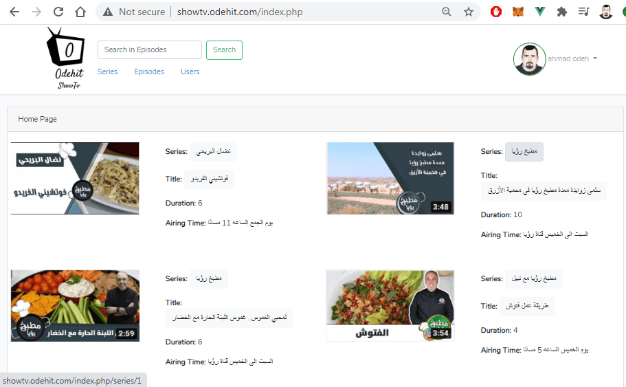
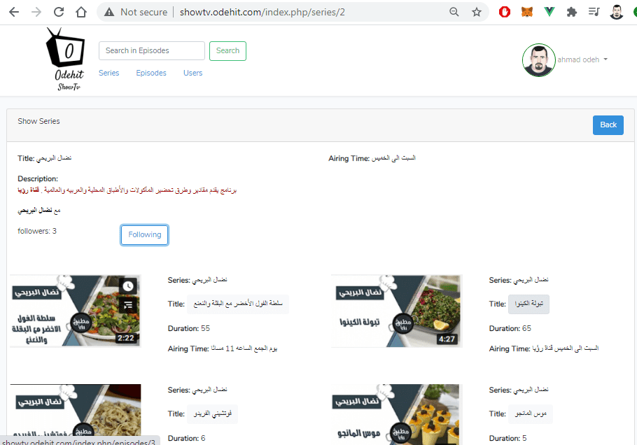
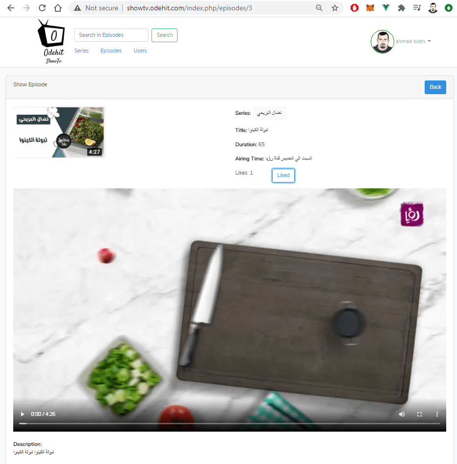
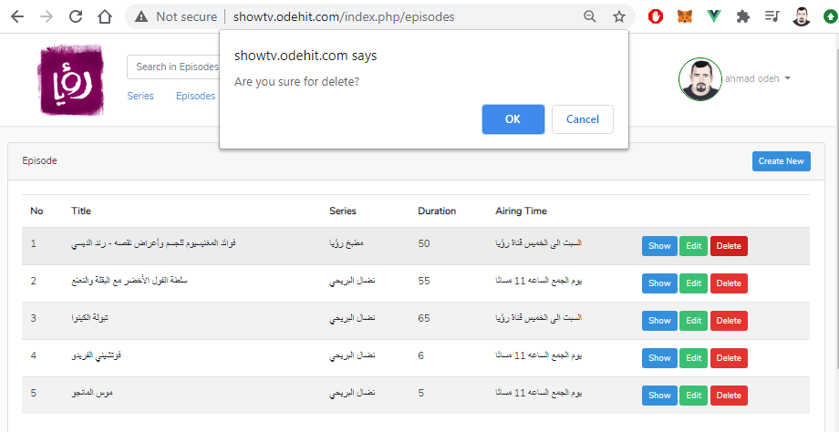
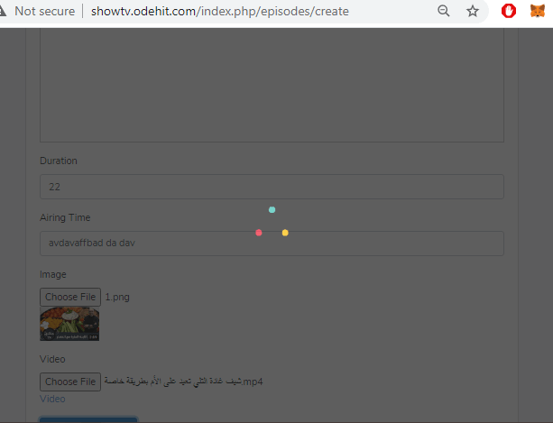

# show.tv
This app is Demo portfolio and start project of TV channels to view there TV Shows or series and each series have Episodes. which allows only registered users to watch series and tv shows on it.

Series/TV Show should have the following properties:
- Title
- Description
- Show time or Airing Time: Ex Monday-Thursday @ 8:30PM

Episodes should have the following properties:
- Title 
- Description
- Duration
- Airing Time: Ex Monday @ 8:30PM
- Thumbnail
- Video content/Asset

## PAGES

#### NAVBAR / Navigation / Menu
- Search for episodes / tv-show
- Homepage link
- Link for 5 tv-shows randomly 

#### HOMEPAGE
- List latest episodes

#### LOGIN
- Email
- Password

#### REGISTER
- Name
- Email
- Password
- User image

#### VIEW Series / TV Shows
- List all episodes related to a TV show 
- (Un)Follow button

#### VIEW EPISODE 
- View episode
- (Dis)like button for episode

#### Admin Side
- Simple admin side
- Can ONLY view users
- Create/View/Edit/List TV shows / Series 
- Create/View/Edit/List Episodes

## Technology Used
-	Laravel 8.2
-	PHP 7.3
-	MySQL
-	Bootstrap 4
-	VueJS
-	jQuery

## Installation 
Clone this repo

```sh
git clone https://github.com/qahmad81/show.tv.git
composer install
```

then create database and do setting on .env then

```sh
php artisan migrate
php artisan key:generate
php artisan storage:link
php artisan config:cache
php artisan route:cache
php artisan view:cache
```
If you dont have dirs storage\app\public\episodes and storage\app\public\users create them

The first user you create will be the admin

You also should be sure your server setup for uploading a large file, if you in local, you can set upload_max_filesize and post_max_size on php.int at higher value.

## Support
if you have problem or you want a free-lance project like this or hire me contact me at following 
- https://www.linkedin.com/in/ahmadodeh81/
- https://www.freelancer.com/u/qahmad1981
- https://www.upwork.com/freelancers/~01a860c10ff10c955e
- qahmad1981@gmail.com
- whatsapp: 00962788705927

I can develop your project like this in your requirement in about 10 hours with uploading and setting up in your hosting at max 10 hour, so in my hour price it will cost you about 200$ only, and sure more customization mean more time and more extra cost.

Any free lance work should be via freelancer.com or upwork.com no direct dealings.

Time will be calculated via (سلطة الإنجاز) app, so no wasted time and no payment for rest time.. just time of work.

https://play.google.com/store/apps/details?id=com.ama.psalad&gl=CH


## Demo Site
you can check this project at link below:
http://showtv.odehit.com/index.php/

please use (index.php) in this site there is problem in htaccess file in this hosting
#### admin user:

qahmad1981@gmail.com

123456789


#### normal user:

skamal@hotmail.com

123456789

the data well reset at each visit

## Screenshots From The Project





