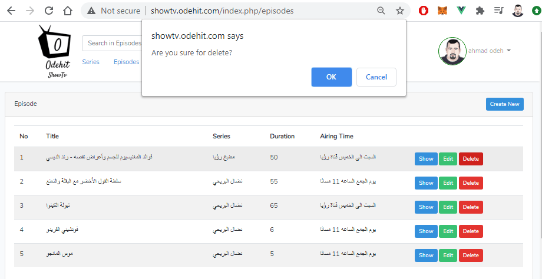

# show.tv
This app is Demo TV channels to view there TV Shows and Episodes.


## Technology Used

-	Laravel 7
-	PHP 7.4
-	MySQL
-	Bootstrap 4
-	VueJS


## Installation 

Clone this repo

```sh
git clone https://github.com/qahmad81/show.tv.git
composer install
```

then create database and do setting on .env then

```sh
php artisan migrate
php artisan key:generate
php artisan storage:link
php artisan config:cache
php artisan route:cache
php artisan view:cache
```
If you dont have dirs storage\app\public\episodes and storage\app\public\users create them

The first user you create will be the admin

You also should be sure your server setup for uploading a large file, if you in local, you can set upload_max_filesize and post_max_size on php.int at higher value.

if you have problem contact me at qahmad1981@gmail.com

## Demo Site
you can check this project at link below:
http://showtv.odehit.com/index.php/
please use (index.php) in this site there is problem in htaccess file in this hosting


## Screenshots From The Project




